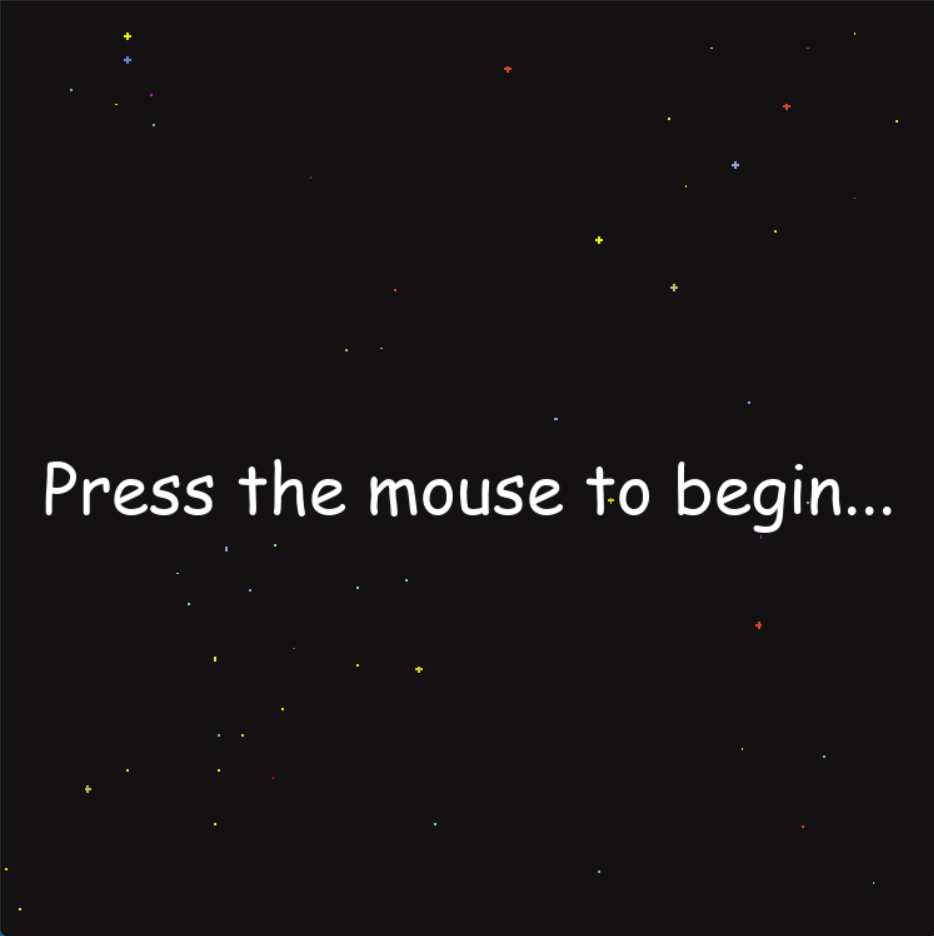
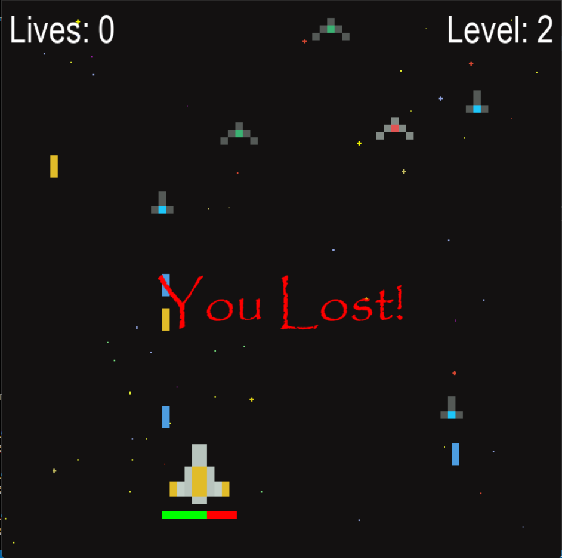

# Space Shooter

A classic arcade-style space shooter where you control a yellow ship and battle waves of enemy spacecraft. Survive as long as you can and defeat increasingly difficult waves!

## Screenshots



<br/>



## How to Play

- Control your ship using **WASD** keys
- Press **SPACE** to shoot lasers at enemies
- Destroy all enemies in each wave to advance to the next level
- Avoid enemy lasers and collisions with enemy ships
- Each wave gets harder with more enemies

## Game Features

- 3 enemy types (Red, Green, Blue ships)
- Progressive difficulty with increasing wave sizes
- Health bar system for your ship
- Laser cooldown mechanic
- Lives system (start with 5 lives)
- Score tracking by level progression
- Main menu with click-to-start

## Controls

| Key | Action |
|-----|--------|
| W | Move up |
| A | Move left |
| S | Move down |
| D | Move right |
| Space | Shoot laser |

## Installation

1. Make sure you have Python installed (3.6+ recommended)

2. Install pygame:
```bash
pip install pygame
```

3. Make sure you have the `assets` folder with all ship and laser images

4. Run the game:
```bash
python main.py
```

## Project Structure

```
├── main.py          # Game logic and loop
├── assets/          # Game images
│   ├── pixel_ship_yellow.png      # Player ship
│   ├── pixel_ship_red_small.png   # Red enemy
│   ├── pixel_ship_green_small.png # Green enemy
│   ├── pixel_ship_blue_small.png  # Blue enemy
│   ├── pixel_laser_yellow.png     # Player laser
│   ├── pixel_laser_red.png        # Red enemy laser
│   ├── pixel_laser_green.png      # Green enemy laser
│   ├── pixel_laser_blue.png       # Blue enemy laser
│   └── background-black.png       # Background image
└── screenshots/     # Gameplay screenshots
```

## Game Mechanics

### Enemy Types
- All enemies have different colored lasers matching their ship color
- Enemies spawn randomly from the top of the screen
- Enemies can shoot back at you

### Health & Lives
- Your ship starts with 100 health
- Each enemy collision reduces health by 10
- Each enemy that reaches the bottom reduces lives by 1
- Game ends when lives reach 0 OR health reaches 0

### Waves
- Start with 5 enemies in wave 1
- Each wave adds 4 more enemies
- Wave length increases progressively

## Asset Credits

Pixel art spaceships and lasers from [insert credit source here]

## License

[MIT](LICENSE)
